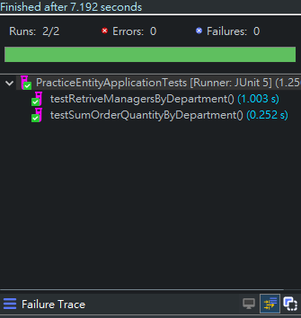

# 簡化專案練習

**1.情境**
**2.實體關係分析**
**3.系統功能**
**4.程式架構**
**5.測試**

---

# 1.情境
* 公司生產部門會有不同的課別，每個部門每個課別都由一個人管理，不會有人跨部門跨課別管理。
* 當生產一個訂單時會需要一個部門內多個課別一起合作 ， 而每個課別也會生產不同的訂單 。  
* 訂單分成預計<font color = red>投入、已投入與入庫</font>三種狀態 
* 訂單生產完後會放到庫房佔存
1. 需要可以查詢一個部門的課別主管的名稱  
1. 計算每個部門有多少已經投入的訂單加總其數量

# 2.實體關係分析
由上面說明可以得知
1. 一個部門會有多個課別
1. 部門與課別都各自有一個管理者
1. 每個課別會負責多筆訂單   
1. 每個訂單會由多個課別負責
1. 每個訂單會有一個入庫位置
1. 每個訂單會有一個狀態 狀態固定有三種(預計投入、已經投入、入庫 )


<div STYLE="page-break-after: always;"></div>

# 3.系統功能
依上述說明可得知需製作以下API：

1. 傳入部門 name 查詢其下課別 所有主管名稱
1. 傳入部門 name 查詢其下課別的所有訂單總和(注意同一訂單在兩個課別的情況 必須去除重複)

# 4.程式架構
程式架構分四個package分述如下：
1. aop：對該系統操作，寫下log紀錄。
2. dao：資料庫操作服務。
3. models：該專案實體管理。
4. demo：測試類。


<div STYLE="page-break-after: always;"></div>

# 5.測試
該測試用之類別，功能概分三個區塊說明，如下圖。


## (1).注入測試所需程式碼
```java
	@Autowired
	private UpdateDemoData updateDemoData;
	@Autowired
	private ExampleItems exampleItems;
```
**1.** ``UpdateDemoData``該類別目的為維護測試用資料之建立。
**2.** ``ExampleItems``該類別目的為資料庫操作。

<div STYLE="page-break-after: always;"></div>

## (2).每次測試前與結束後之操作
```java
@BeforeEach
void init() {
	updateDemoData.save();
}
@AfterEach
void endProcess() {
	updateDemoData.deleteAll();
}
```
**1.** ``@BeforeEach`` 每一次測試前備置資料庫實體化資料。
**2.** ``@AfterEach``每一次測試後刪除資料庫實體化資料。

## (3).測試目標
```java
/**
* 傳入部門 name 查詢其下課別 所有主管名稱 傳入參數:"IT"
* 預期結果:[{"name":"joe","EmployeeId":2},{"name":"alice","EmployeeId":5}]
*/
@Test
void testRetriveManagersByDepartment()
/**
* 傳入部門 name 查詢其下課別的所有訂單總和(注意同一訂單在兩個課別的情況 必須去除重複)
* 傳入參數：'RD'
* 預期結果:1560
*/
@Test
void testSumOrderQuantityByDepartment()
```



---
專案下載：[https://github.com/etonson/PracticeEntity/tree/main/readMe.md](https://github.com/etonson/PracticeEntity/tree/main/readMe.md)